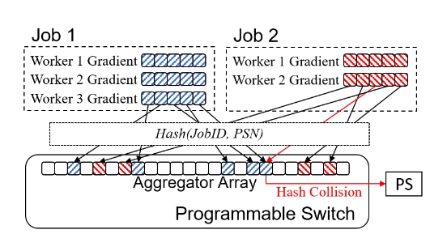

# INC (In-Network Collectives) Simulator for ns-3

An ns-3 based simulator for In-Network Collectives (INC), built on an ATP-like transport to study how in-switch aggregation accelerates distributed training communication at scale.
Codebase: contrib/atp
Core implementation: contrib/atp/model

## Research Goal

Evaluate the acceleration benefits of INC protocols on large-scale network topologies for distributed training workloads.

## Key Features
* ATP-like L4 protocol with in-switch aggregation.
* Explicit modeling of senders and receivers.
* Per-job traffic tagging and accounting.
* Switch memory contention and hash-collision handling.
* Runnable examples demonstrating two concurrent jobs.

## Architecture and Components

### ATPL4Protocol
* Implements the ATP-like transport at L4.
* Emulates in-switch aggregation behavior.
* Models multi-job contention for limited switch memory.
* Handles aggregator hashing and collision resolution.

### ATPSocket
* Application-level API to the INC transport.
* Connection management: Connect, Listen.
* Data I/O: Send, Receive.
* Flow control, ACK handling, timeout/retransmission.

### ATPTxBuffer (sender buffer)

* Queues outbound packets.
* Maintains congestion window (cwnd).
* Retransmission management.

### ATPBulkSendApplication

* Bulk data sender driving throughput-oriented transfers.
* Works with ATPSocket and tags traffic per job.

### ATPPacketSink

* Receiver application that consumes packets.
* Reports total bytes and per-job bytes.

### ATPTag

* Annotates packets with jobId, seqNum, and fan-in degree (faninDegree).

## INC in the Switch

* Aggregation is performed inside switches via protocol hooks and routing helpers.
* Fan-in degree config determines how many workers contribute to an aggregate.
* Hashing based on (jobId, seqNum) maps flows to aggregator slots.
* Memory constraints and collisions are modeled to reflect realistic switch behavior.
## Example
Two Jobs Communicating Concurrently
Topology with multiple workers per job sending to a common sink;

Demonstrates per-job accounting, aggregation, ECN thresholding, and cwnd traces.

